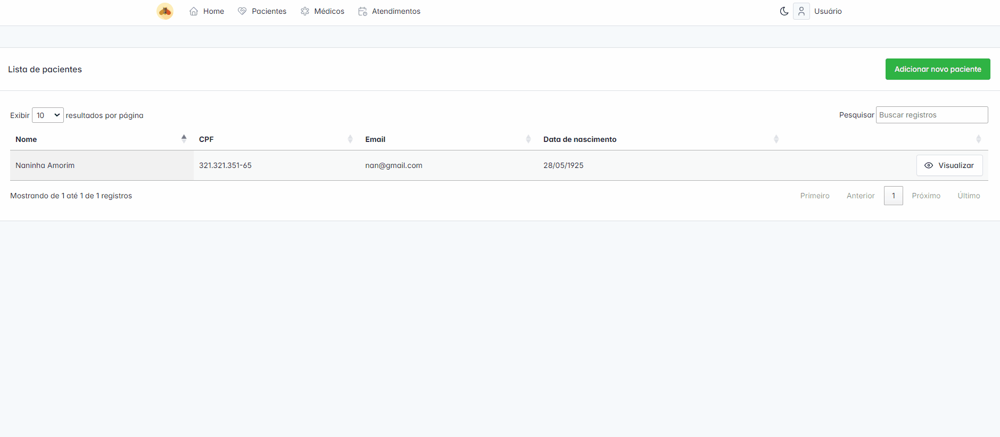
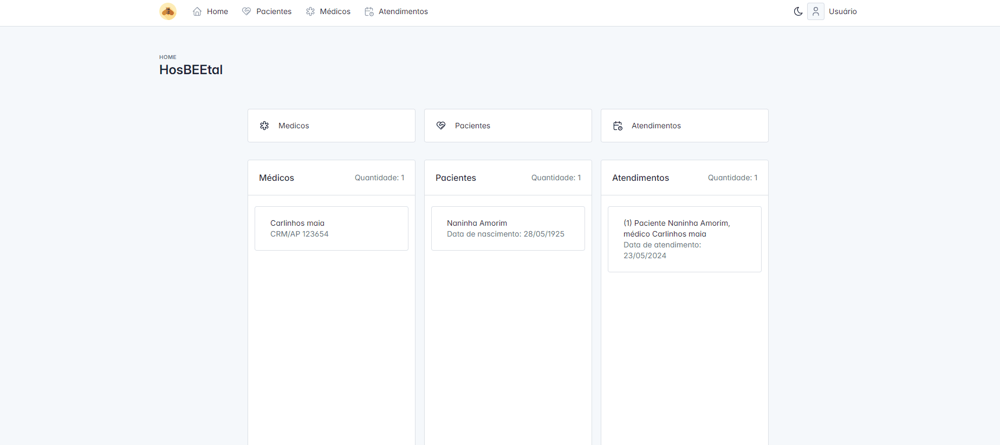

## HosBEEtal

Sistema de gestão hospitalar HosBEEtal: todos por uma saúde <strong>MEL</strong>lhor!

## Funcionalidades

- Cadastro de pacientes, médicos e atendimentos;
- Relatório de atendimentos por médicos;
- Relatório de atendimentos por cada paciente.

## Instalação

    #Clone esse repositório
    git clone https://github.com/zuer02/app-hosbeetal.git
    
    #Entre no diretório em que ele está
    cd app-hosbeetal

    #Instale as dependências necessárias
    composer install

    npm install

    #Renomeie o .env.example para .env  e configure com as informações do seu banco de dados

    #Execute as migrations
    php artisan migrate

    #Sirva a aplicação
    php artisan serve

    npm run dev

## Cadastrando...

## Relatórios

## Muito obrigado!
